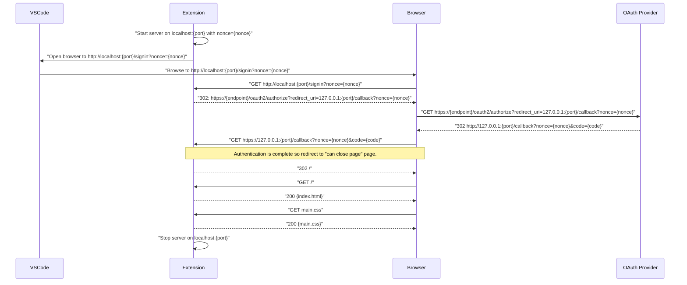

# Azure Account Extension Design and Architecture

This document provides notes on the design and architecture of the Azure Account extension that may be helpful to maintainers.

> NOTE: This document contains Mermaid-based diagrams. Use the [VS Code Mermaid extension](https://marketplace.visualstudio.com/items?itemName=bierner.markdown-mermaid) for viewing and editing locally.

## Desktop Authentication Flow

For each authentication event, the extension starts a local HTTP server on a random port (`{port}`) and shares with it a random nonce (`{nonce}`) to ensure only its redirects will be accepted. The extension then asks VS Code to open a browser window and navigate to the local `/signin` endpoint. The extension then redirects the request to the OAuth provider, providing its `/callback` endpoint as the redirection URL. After authentication, the OAuth provider will redirect to the redirection URL and include the server code as a query parameter. Before returning a response, the extension will exchange the server code for access/refresh tokens, using the SDK for the selected OAuth provider. When complete, the extension will redirect the browser its `/` endpoint, which returns a final "you can close this page" HTML page. With that done, the server will be scheduled for shutdown (within 5s).

